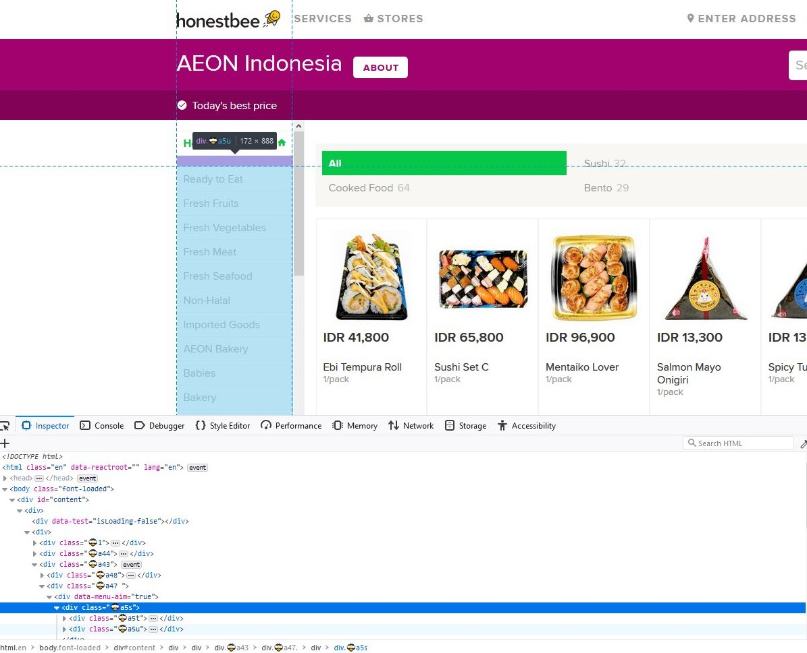

# Akka crawler to crawl HappyFresh for product data and images.

## js

Builds insert query from store info on Google Maps.

- find store page on Google Maps, copy its text to the file
- one or two differs in where the text is copied from

## akka
Crawls json and images

- needs department and category list
- first copy outer html from a store page

- then extract the hrefs using this tool http://tools.buzzstream.com/link-building-extract-urls

- paste the result to CategoryParser, run, and paste the result to Seed

- run StartImageCrawler or StartImageCrawler

Next time use Google Maps API (non free)